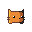

# Cat Space

<p align="center">
    
</p>

## Description

Fall Cat is a simple yet addictive game where your goal is to prevent the cats from landing on their feet. If one falls, you lose. Test your reflexes and enjoy the fun!

## License

This project is for educational purposes and is not intended for commercial use.

## Acknowledgements

- Godot Engine documentation and community for resources and tutorials.

## Requirements

- Godot Engine 4.3 or later.

## Installation

1. Clone the repository:
    ```sh
    git clone https://github.com/yourusername/fall-cat.git
    ```
2. Open the project in Godot Engine.

## How to Play

- Use the arrow keys to move.
- Prevent the cats from landing on their feet.
- If a cat lands on its feet, the game is over.

## Screenshots


## Music Used

- **Tronicles**: [YouTube Link](https://www.youtube.com/watch?v=JUegvqJdyQI)
- **Evolution**: [YouTube Link](https://youtu.be/a6v-RL5ypR4?feature=shared)
- **Sirius**: [YouTube Link](https://youtu.be/60llyQkMces?feature=shared)

## Sprites

- **ANZIMUS (LEGACY COLLECTION)**: [Itch.io Link](https://ansimuz.itch.io/gothicvania-patreon-collection)

---

*This project is powered by the [Godot Engine](https://godotengine.org/).*